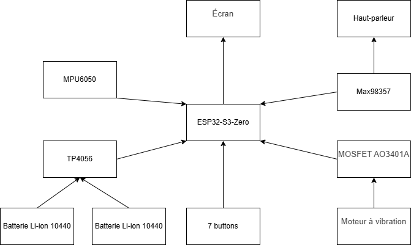
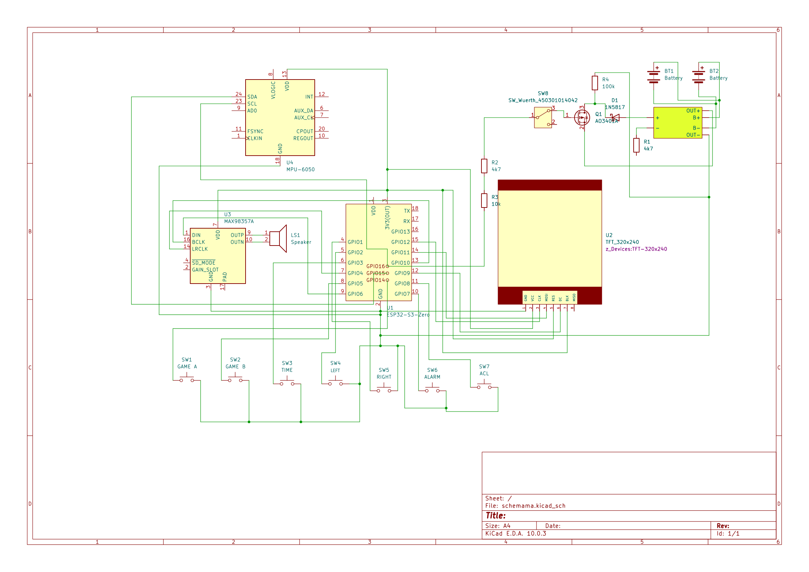

# Your Project Name

| | |
|-|-|
|`Author` | SANDU Ștefăniță-Iulian

## Description
Ce projet reproduit les jeux de type Nintendo Game & Watch ; il s'agit en fait d'une console de jeux et d'une montre. Il est rechargeable, dispose d'un volume réglable, d'un indicateur de batterie et d'un retour haptique.

## Motivation
Je souhaitais en savoir plus sur l'histoire des consoles de jeux vidéo en approfondissant ma compréhension du processus de fabrication d'une console à partir de zéro. La Nintendo Game & Watch est un produit des années 1980 qui a contribué à la popularité des jeux vidéo et de l'entreprise, celle-ci ayant même porté certains de ses jeux phares sur l'un de ces appareils, à l'instar du Super Mario Bros. original sur NES à l'occasion du 35e anniversaire de la série.

## Architecture

### Block diagram

<!-- Make sure the path to the picture is correct -->

### Schematic

### Components

<!-- This is just an example, fill in with your actual components -->

| Device | Usage | Price |
|--------|--------|-------|
| 7 x Push Boutons | Bouton | [0.36 RON](https://www.optimusdigital.ro/ro/butoane-i-comutatoare/1119-buton-6x6x6.html) |
| MPU6050 | Accéléromètre | [14.68 RON](https://www.optimusdigital.ro/ro/senzori-senzori-inertiali/13611-modul-accelerometru-i-giroscop-cu-3-axe-mpu6050-cu-pini-lipiti.html) |
| TP4056 | Module chargeur | [3.91 RON](https://www.optimusdigital.ro/ro/electronica-de-putere-incarcatoare/7534-incarcator-tp4056-cu-micro-usb-pt-baterie-lipo-1a-cu-protectie-pentru-circuite.html) |
| Commutateur à glissière | Ouvrir ou fermer l'emulateur | [0.49 RON](https://ardushop.ro/ro/butoane--switch-uri/803-slider-switch-2-pozitii-6427854010391.html) |
| Module LCD | Écran | [67.21 RON](https://ardushop.ro/ro/electronica/1348-modul-lcd-24-cu-spi-controller-ili9341-6427854019523.html)|
| Moteur à vibration | Haptic feedback | [4.14 RON](https://ardushop.ro/ro/motoare-si-drivere/13-motor-cu-vibratii-1027-3v-6427854003614.html)|
| 2 x Résistances 4.7 kΩ, 1 x 10 kΩ, 1 x 100 kΩ | Composants de raccordement | [0.13 RON](https://ardushop.ro/ro/componente-discrete/465-813-rezistor-1-4w-1-buc-alege-valoarea.html) |
| Haut-parleur | Audio | [4.55 RON](https://electronicmarket.ro/mini-difuzor-1w-8-ohm-20x14mm) |
| Diode Schottky 1N5817 | Composants de raccordement | [0.64 RON](https://electronicmarket.ro/en-gb/1n5817-schottky-diode-%E2%80%93-1a-20v-dip-package?search=1N5817) |
| Max98357 | Amplificateur audio | [30 RON](https://www.emag.ro/amplificator-audio-max98357-i2s-compatibil-cu-esp32-si-raspberry-pi-emg238/pd/DVYJWJYBM/) |
| ESP32-S3-Zero | Microprocessus | [53.99 RON](https://www.emag.ro/placa-de-dezvoltare-esp32-s3-zero-cu-wifi-si-bluetooth-5-0-gpt102/pd/DHVQGJ3BM/) |
| Batteries Li-ion 10440 | Source d'alimentation | [61.50 RON](https://www.emag.ro/baterii-universal-10440-700-mah-li-ion-2-bucati-incarcare-usoara-economic-cablul-usb-c-inclus-multicolor-reincarcabile-inlocuibile-capacitate-nominal-700-mah-104402szt/pd/DL4QWJ3BM/) |
| DMP3098L-7 | Composants de raccordement | [8.94 RON](https://www.emag.ro/tranzistor-canal-p-smd-p-mosfet-sot23-diodes-incorporated-dmp3098l-7-t254531/pd/D4Z7SPYBM/) |
| Vis | Monter les composants | [29.98 RON](https://www.emag.ro/set-800-suruburi-auto-filetante-m2-diferite-lungimi-din-otel-carbon-zincat-organizator-inclus-utilizare-multipla-negru-61061318/pd/D2JLV32BM/) |

### Libraries

<!-- This is just an example, fill in the table with your actual components -->

| Library | Description | Usage |
|---------|-------------|-------|
| [lib-name1](link-to-lib) | official description of the lib | Used for accesing the peripherals of the microcontroller  |
| [lib-name2](link-to-lib) | official description of the lib | Used for accesing the peripherals of the microcontroller  |

## Log

<!-- write every week your progress here -->

### Week 6 - 12 May

### Week 7 - 19 May

### Week 20 - 26 May

## Reference links

<!-- Fill in with appropriate links and link titles -->

[Tutorial 1](https://www.youtube.com/watch?v=wdgULBpRoXk&t=1s&ab_channel=BenEater)

[Article 1](https://www.explainthatstuff.com/induction-motors.html)

[Link title](https://projecthub.arduino.cc/)
